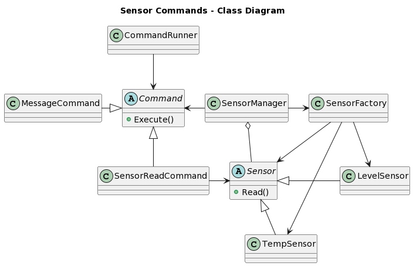
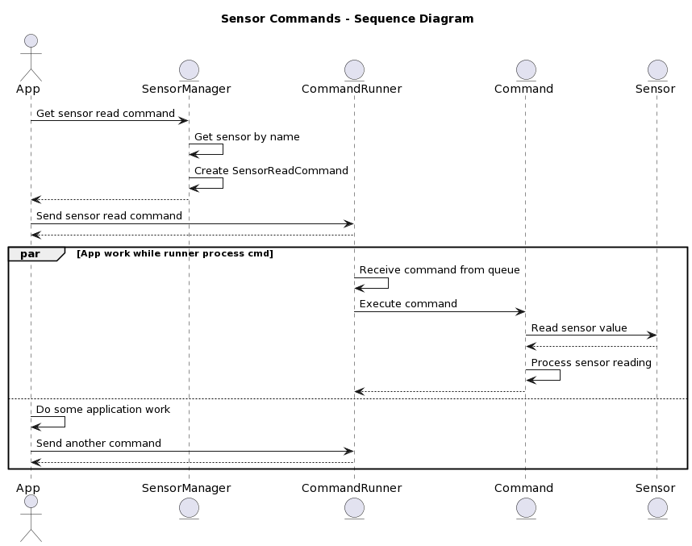

# Sensor Commands

Este ejemplo consiste en un sistema genérico de administración de sensores. El mismo demuestra el uso de múltiples patrones de diseño de software y conceptos de programación avanzada en Pythin. Entre estos elementos se encuentran:

- Clases abstractas y polimorfismo
- Patrón de diseño de comandos (command)
- Patrón de diseño de estrategia (strategy)
- Multithreading con Python threads

## Pasos de construcción
Desde el contenedor de desarrollo en el directorio base del ejemplo (`examples/python/sensor_commands/`), ejecute los siguiente comandos para generar un ambiente virtual e instalar el paquete de Python del ejemplo:

```console
$ python3 -m venv .venv
$ source .venv/bin/activate
$ pip3 install -e .
```

Una vez instalado, puede correr el ejemplo ejecutando el siguiente comando desde el directorio base del mismo:

```console
$ sensor_cmds
```

## Diagrama de clases


## Diagrama de secuencia

